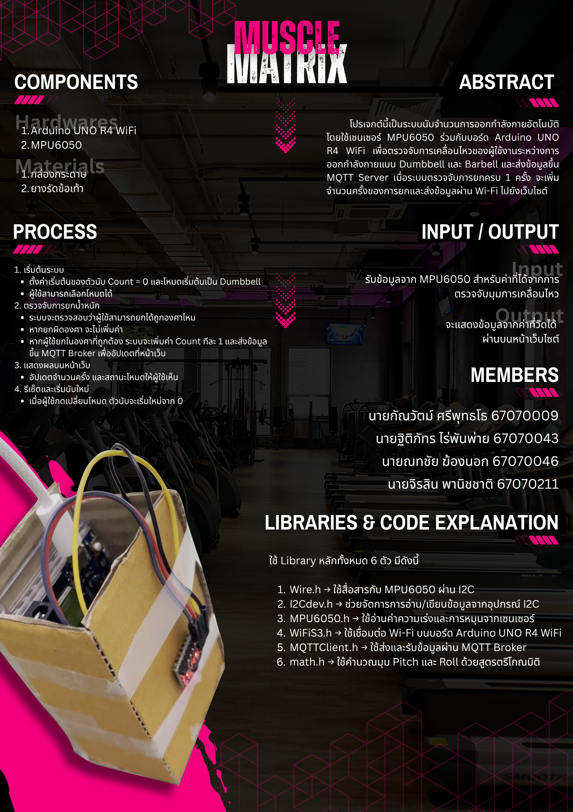

# MuscleMatrix
Physical Computing Project 2025 - IT KMITL
## Overview
การใช้เซนเซอร์ไจโรสโคปหรือ IMU (เช่น MPU6050) เพื่อวัดความเร็วเชิงมุม (Angular Velocity) ซึ่งสามารถนำมาใช้ในการนับจำนวนครั้งที่ออกกำลังกาย เช่น การยกดัมเบล (Dumbbell Curl) หรือการยกบาร์เบล (Barbell Lift) และทำการวิเคราะห์ข้อมูลที่ได้ผ่านเว็บแอปพลิเคชัน
## Abtract
โปรเจกต์นี้เป็นระบบนับจำนวนการออกกำลังกายอัตโนมัติ โดยใช้เซนเซอร์ MPU6050 ร่วมกับบอร์ด Arduino UNO R4 WiFi เพื่อตรวจจับการเคลื่อนไหวของผู้ใช้งานระหว่างการออกกำลังกายแบบ Dumbbell และ Barbell และส่งข้อมูลขึ้น MQTT Server เมื่อระบบตรวจจับการยกครบ 1 ครั้ง จะเพิ่มจำนวนครั้งของการยกและส่งข้อมูลผ่าน Wi-Fi ไปยังเว็บไซต์
## Member (สมาชิก)
| ID       | Name (ชื่อ)                     |
|----------|---------------------------------|
| 67070009 | กัณวัตม์ ศรีพุทธโธ  |
| 67070043 | ฐิติภัทร ไร่พันพ่าย  |
| 67070046  | ณทชัย ฆ้องนอก |
| 67070211  | จิรสิน พานิชชาติ  |
## Info Page
[👉 Open Info Page](https://xxuiujkuxx.github.io/MuscleMatrix/infoPage/infoIndex.html)
!!! NOT RESPONSIVE ON MOBILE DEVICE
## Home page (actual software)
[👉 Open Home page](https://xxuiujkuxx.github.io/MuscleMatrix/index.html)
## Presentation Video
[👉 Youtube](https://youtu.be/LJDeZDLrBZw)
## Poster

## Reference
- [Convert raw data from MPU6050](https://samselectronicsprojects.blogspot.com/2014/07/getting-roll-pitch-and-yaw-from-mpu-6050.html)
- [UI/UX](https://www.youtube.com/watch?v=A-EWDi1M_1E&list=PLTGJJtjJqB_C2If2qb1Swdgeb-wqwznOr&index=139)
- [Project Reference](https://www.instructables.com/Using-an-Arduino-Neural-Network-to-Count-Gym-Reps)
